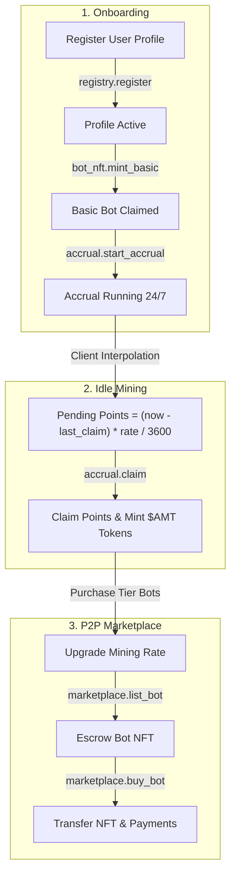

# AutoMint — Stellar Soroban Testnet Implementation

[](https://github.com/Alaka-ibr/AutoMint/actions/workflows/ci.yml)
[](https://github.com/Alaka-ibr/AutoMint/actions/workflows/frontend-tests.yml)
[](https://github.com/Alaka-ibr/AutoMint/actions/workflows/mutation-testing.yml)

**Idle auto-mining dApp on Stellar (Soroban).**
Deploy NFT bots that accrue `$AMT` tokens 24/7. No active tapping required. Trade bots on an on-chain P2P escrow marketplace and compete on a global leaderboard.

---

## Repository Status Overview

The `testnet-implementation` branch contains a fully implemented, working testnet codebase (~10,000 lines of code across smart contracts, Next.js frontend, unit test suites, and GitHub Actions CI pipelines).

### Contract Status Table

| Contract | Path | Language | Implementation Status | Test Coverage | Key Features |
|---|---|---|---|---|---|
| **Registry** | `contracts/registry/` | Rust | Production-ready | Comprehensive | Profile registration, unique usernames, points ledger, leaderboard sorting |
| **BotNFT** | `contracts/bot_nft/` | Rust | Production-ready | Comprehensive | Sequential minting, 5 bot tiers, ownership transfer, TTL renewal |
| **Accrual** | `contracts/accrual/` | Rust | Production-ready | Comprehensive | Time-based point math, $AMT mint redemption, threshold logic |
| **Marketplace**| `contracts/marketplace/` | Rust | Production-ready | Comprehensive | P2P bot escrow, positive price validation, 2.5% admin fee, cancellation |
| **AMT Token** | `contracts/token/` | Rust | Production-ready | Comprehensive | SEP-41 compliant token, minting, burning, allowances, set_admin transfer |
| **Testutils** | `contracts/testutils/` | Rust | Production-ready | Internal | Shared ledger time advance helpers (`advance_ledger`, `advance_past_ttl`) |

### Frontend Status Table

| Frontend Component | Path | Tech Stack | Implementation Status | Test Suite | Description |
|---|---|---|---|---|---|
| **App Router Pages** | `frontend/src/app/` | Next.js 14 | Complete | Integration Tests | Landing page, Dashboard, Marketplace, Leaderboard, Profile |
| **UI & Layout** | `frontend/src/components/` | React 18, Tailwind | Complete | Component Tests | Header, Footer, Modals, Skeleton loaders, Bot Cards, Counters |
| **React Query Hooks** | `frontend/src/hooks/` | TanStack Query | Complete | Hook Unit Tests | `useWallet`, `useAccrual`, `useMarketplace`, `useLeaderboard`, `useBotDetails` |
| **Stellar SDK Client** | `frontend/src/lib/` | `@stellar/stellar-sdk` | Complete | Smoke & SDK Tests | RPC retry wrappers (`rpcRetry.ts`), contract callers (`contracts.ts`) |
| **Wallet Store** | `frontend/src/store/` | Zustand | Complete | Store Unit Tests | Client-side wallet state, active public key, network passphrase |

---

## How It Works



### Bot Tiers & Mining Rates

| Tier | Price | Mining Rate | Points Required for 1 `$AMT` |
|---|---|---|---|
| **Basic** | Free | 1 pt/hr | 100 points |
| **Bronze** | 500 XLM | 5 pt/hr | 100 points |
| **Silver** | 2,000 XLM | 25 pt/hr | 100 points |
| **Gold** | 7,500 XLM | 100 pt/hr | 100 points |
| **Diamond** | 25,000 XLM | 500 pt/hr | 100 points |

*Marketplace Trading Fee: 2.5% (250 bps).*

---

## Repository Structure

```
AutoMint/
├── contracts/                  # Soroban Smart Contracts (Rust)
│   ├── accrual/                # Point accrual math & token mint claims
│   ├── bot_nft/                # NFT bot minting, tiers & ownership
│   ├── marketplace/            # P2P bot NFT escrow marketplace
│   ├── registry/               # User profiles, usernames & leaderboard
│   ├── testutils/              # Shared dev testing utilities (TTL & time advance)
│   └── token/                  # SEP-41 compliant AMT token contract
├── frontend/                   # Next.js 14 Frontend Application
│   ├── src/app/                # App Router pages & layout
│   ├── src/components/         # UI, Layout, Dashboard, Marketplace, Leaderboard components
│   ├── src/hooks/              # React Query state & mutation hooks
│   ├── src/lib/                # Stellar SDK, RPC retry logic & contract clients
│   ├── src/store/              # Zustand wallet store
│   └── src/types/              # Shared TypeScript domain interfaces
├── docs/                       # Project Documentation
│   ├── ARCHITECTURE.md         # Call graphs, auth matrix, storage layout & events (#212, #566)
│   ├── DEPLOY.md               # Contract deployment runbook: keys, deploy.sh, verification (#217)
│   ├── DEPLOYMENT.md           # Frontend hosting, env vars & CI preview deployments
│   ├── MANUAL_TEST_REPORT.md   # Testnet end-to-end manual verification checklists
│   ├── ONBOARDING.md           # Developer codebase reading order guide (#250)
│   └── FLOWS.md                # Sequence flows for core user journeys
├── scripts/                    # Build & Deployment Automation
│   ├── deploy.sh               # Contract build, deployment & initialization script
│   │                           #   (crash-resilient manifest + --dry-run/--force, #557)
│   └── verify-deployment.sh    # Reproducible-build wasm hash verifier (#559)
├── indexer/                    # Soroban event indexer + aggregate API + ops dashboard (#563)
│   ├── src/                    # poller, decoder, SQLite store, Express API
│   ├── public/index.html       # ops dashboard
│   └── docs/EVENTS.md          # every indexed event schema
├── deployments/                # gitignored per-network manifests (deploy.sh output)
├── CHANGELOG.md                # Release & milestone changelog (#246)
└── Cargo.toml                  # Cargo workspace manifest
```

---

## Getting Started

### Prerequisites
- **Rust & Soroban CLI** (for contract development):
  ```bash
  curl --proto '=https' --tlsv1.2 -sSf https://sh.rustup.rs | sh
  rustup target add wasm32v1-none
  cargo install --locked stellar-cli --version 21.4.0 --features opt
  ```
- **Node.js 18+ & npm** (for frontend development):
  ```bash
  node -v
  npm -v
  ```
- **Freighter Wallet**: Install the [Freighter extension](https://freighter.app) and set network to **Testnet**.

---

### Step-by-Step Installation & Local Setup

1. **Clone the Repository**:
   ```bash
   git clone https://github.com/Alaka-ibr/AutoMint.git
   cd AutoMint
   git checkout testnet-implementation
   ```

2. **Run Contract Tests**:
   ```bash
   cargo test --workspace
   ```

3. **Install & Launch Frontend**:
   ```bash
   cd frontend
   npm install
   cp .env.example .env.local
   npm run dev
   ```
   Open [http://localhost:3000](http://localhost:3000) in your browser.

4. **Deploy Contracts to Testnet (Optional)**:
   ```bash
   # Generate testnet identity and fund via Friendbot
   stellar keys generate mykey --network testnet
   curl "https://friendbot.stellar.org/?addr=$(stellar keys address mykey)"
   
   # Run automated deploy & initialize script
   ./scripts/deploy.sh testnet mykey
   ```
   The deployment script automatically populates `frontend/.env.local` with the new contract IDs.

---

## Testing & CI Discipline

All PRs undergo automated CI checks on GitHub Actions:

```bash
# Smart Contract Tests (Rust Workspace)
cargo test --workspace

# Frontend Unit & Integration Tests (Jest + React Testing Library)
cd frontend && npm test

# Bundle Budget & Polyfill Validation
cd frontend && npm run check-bundle-size
```

Automated CI Workflows:
- `.github/workflows/ci.yml`: Cargo workspace test suite.
- `.github/workflows/frontend-tests.yml`: Frontend Jest suite with jsdom polyfills & Stellar SDK smoke test.
- `.github/workflows/mutation-testing.yml`: Cargo mutants test execution.
- `.github/workflows/frontend-bundle-budget.yml`: Size limits enforcer.

---

## Branching & Pull Request Guidelines

1. **Base Branch**: Always branch off **`main`**.
   ```bash
   git checkout main
   git pull origin main
   git checkout -b fix/your-feature-name
   ```
2. **PR Target Branch**: Open your Pull Request targeting **`main`**.
3. **Commit Standard**: Write clean, descriptive commit messages describing what was modified and referencing issue numbers (`Closes #123`).

---

## Documentation Links

- [Contract Architecture Specification](docs/ARCHITECTURE.md) (`docs/ARCHITECTURE.md`)
- [Contract Deployment Runbook](docs/DEPLOY.md) (`docs/DEPLOY.md`)
- [Developer Onboarding Guide](docs/ONBOARDING.md) (`docs/ONBOARDING.md`)
- [Sequence & Journey Flows](docs/FLOWS.md) (`docs/FLOWS.md`)
- [Frontend Deployment & CI Preview Documentation](docs/DEPLOYMENT.md) (`docs/DEPLOYMENT.md`) — includes the `deployments/<network>.json` manifest schema and reproducible-build verification (#557/#559)
- [Testnet Manual Test Report](docs/MANUAL_TEST_REPORT.md) (`docs/MANUAL_TEST_REPORT.md`)
- [Dependency Policy](docs/DEPENDENCIES.md) (`docs/DEPENDENCIES.md`) — exact `soroban-sdk` pin and `testutils` feature rationale (#562)
- [Indexer README](indexer/README.md) — run the event indexer, aggregate API & ops dashboard (#563)
- [Indexed Event Schemas](indexer/docs/EVENTS.md) — every event the indexer consumes (#563)
- [Project Changelog](CHANGELOG.md) (`CHANGELOG.md`)

---

## License

Apache License 2.0 (Apache-2.0). See [LICENSE](LICENSE) for details.
