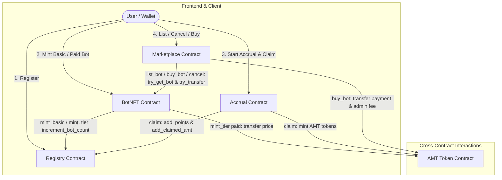
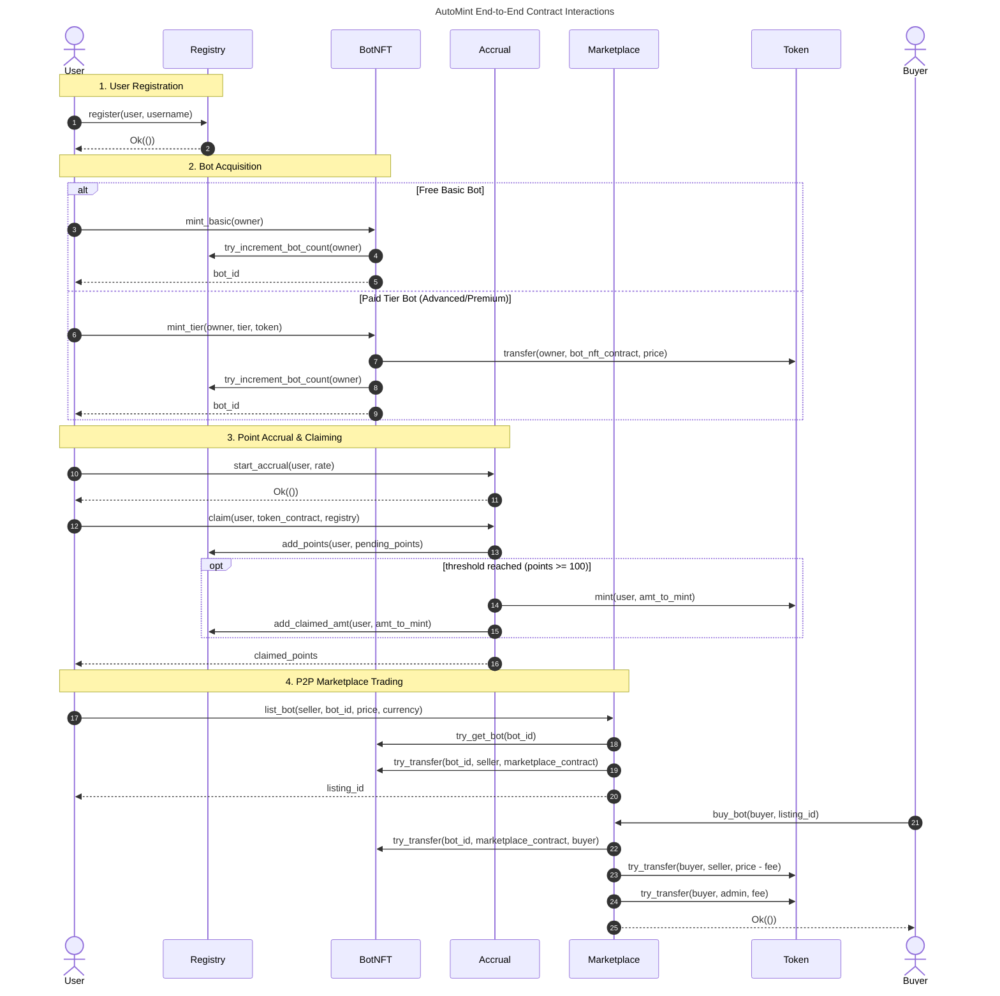
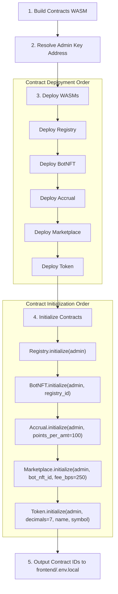

# AutoMint Architecture & Contract Interaction Specification

This document provides the formal architectural specification for the AutoMint smart contract system deployed on Stellar (Soroban). It covers the cross-contract call graph, contract administration, full authorization matrix, storage layout and TTL retention policies, event catalogue, and deployment wiring order.

---

## 1. Contract Dependency Diagram & Call Graph

The AutoMint architecture comprises five Soroban smart contracts interacting via cross-contract calls:

- **Registry (`automint_registry`)**: Central user directory, username registry, point tracking, and leaderboard index.
- **BotNFT (`automint_bot_nft`)**: Non-fungible token contract representing idle mining bots across 5 tiers.
- **Accrual (`automint_accrual`)**: Time-based point calculation and token mint redemption engine.
- **Marketplace (`automint_marketplace`)**: Non-custodial escrow marketplace for trading Bot NFTs using AMT or XLM tokens.
- **AMT Token (`automint_token`)**: SEP-41 compliant token contract representing the `$AMT` asset.

### Contract Responsibilities & Outbound Dependencies

| Contract | Crate / WASM | Owns | Calls Out To | Called By |
|---|---|---|---|---|
| Registry | `automint_registry` | User profiles, username uniqueness, point totals, claimed `$AMT` tally, bot counts, leaderboard ordering | *(none — leaf contract)* | BotNFT, Accrual, frontend |
| BotNFT | `automint_bot_nft` | Bot NFT records, tier table, ownership index, accrual-rate lookup | Registry (`increment_bot_count`), Token (`transfer` for paid tiers) | Marketplace, frontend |
| Accrual | `automint_accrual` | Per-user accrual state, elapsed-time point math, points→`$AMT` conversion | Registry (`add_points`, `add_claimed_amt`), Token (`mint`) | Frontend |
| Marketplace | `automint_marketplace` | Listings, escrow custody, 2.5% fee split | BotNFT (`get_bot`, `transfer`), Token (`transfer`) | Frontend |
| AMT Token | `automint_token` | Balances, allowances, SEP-41 surface | *(none — leaf contract)* | BotNFT, Accrual, Marketplace, frontend |

Two contracts are **leaves** (Registry and Token: they never make outbound cross-contract calls), and the dependency graph is acyclic. Registry and Token are therefore deployed first in dependency terms, and every other contract holds an address pointing at what it needs. Cross-contract calls are made through generated clients — `BotNFTContractClient`, `RegistryContractClient`, and `soroban_sdk::token::Client` — and the callers deliberately use the `try_*` variants so a downstream failure surfaces as a typed error rather than trapping the whole transaction.

**Address wiring.** Only two dependencies are stored on-chain at initialization: BotNFT holds `Registry`, and Marketplace holds `bot_nft` inside its `Config`. Every other dependency is passed in per call — Accrual takes `token_contract` and `registry` as `claim` arguments, BotNFT takes `token` as a `mint_tier` argument, and Marketplace reads the payment token from `listing.currency`. This keeps the deployment order flexible but means the **frontend is responsible for passing the correct contract IDs**; a wrong address is a per-transaction failure, not a deploy-time one.

### Cross-Contract Call Flow

### Detailed Invocations

### Ordering & Failure Semantics of `buy_bot`

`Marketplace::buy_bot` performs three cross-contract calls in a deliberate order, and the ordering is a documented trade-off rather than an accident:

1. **NFT transfer first** (`BotNFT::try_transfer` escrow → buyer). If this fails, the call aborts with `BotTransferFailed` and no funds have moved.
2. **Seller payment second** (`Token::try_transfer` buyer → seller, `price - fee`). If this fails, the call returns `PaymentFailed` and the whole transaction reverts, so the NFT transfer in step 1 is rolled back with it.
3. **Admin fee last** (`Token::try_transfer` buyer → admin, 2.5%). This result is **intentionally discarded** — a failing fee transfer does not abort a purchase that has otherwise settled correctly between buyer and seller.

The guard rails around this path: `buyer == listing.seller` is rejected with `Unauthorized`, an inactive listing is rejected with `ListingNotActive`, and the fee arithmetic uses `checked_mul`/`checked_div`/`checked_sub` so an extreme listing price returns `Overflow` instead of panicking. On success the listing is flagged `active: false` and removed from the `ActiveListings` index before the `bought` event is published.

Note that `buy_bot` does **not** call Registry: bot counts are not rebalanced between seller and buyer on a marketplace sale. `Registry::decrement_bot_count` exists and is user-authorized, but no contract invokes it as part of the purchase flow.

---

## 2. Authorization Matrix

The table below specifies the required authentication signer, verification mechanism, and authorization scope for every function in the contract workspace.

| Contract | Function | Required Signer | Verification Mechanism | Scope / Access Restrictions |
|---|---|---|---|---|
| **Registry** | `initialize` | Admin | `admin.require_auth()` | One-time initialization; sets admin |
| | `register` | User | `user.require_auth()` | Unique username (1-32 chars); creates profile |
| | `is_registered` | None | Public view | Query registration status |
| | `get_user` | None | Public view | Fetch user profile data |
| | `add_points` | Accrual Caller | Unrestricted internal caller | Increases user's total points |
| | `increment_bot_count` | BotNFT Caller | Unrestricted internal caller | Increments user's bot count |
| | `decrement_bot_count` | User | `user.require_auth()` | Decrements bot count (floors at 0) |
| | `add_claimed_amt` | Accrual Caller | Unrestricted internal caller | Adds to claimed `$AMT` token tally |
| | `get_leaderboard` | None | Public view | Sorted user profiles by total points |
| | `total_users` | None | Public view | Returns global registered user count |
| | `admin` | None | Public view | Returns contract admin address |
| **BotNFT** | `initialize` | Admin | `admin.require_auth()` | Sets admin and Registry contract address |
| | `mint_basic` | Owner | `owner.require_auth()` | Mints free Basic bot (rate: 1 pt/hr) |
| | `mint_tier` | Owner | `owner.require_auth()` | Mints tier bot; transfers token price if > 0 |
| | `transfer` | Owner (From) | `from.require_auth()` | Transfers bot ownership between accounts |
| | `get_bot` | None | Public view | Fetch bot metadata and tier |
| | `get_user_bots` | None | Public view | Fetch array of bot IDs owned by user |
| | `get_user_total_rate` | None | Public view | Calculates sum of accrual rates for user |
| | `get_tier_info` | None | Public view | Returns name, rate, and price for tier |
| | `admin` | None | Public view | Returns contract admin address |
| **Accrual** | `initialize` | Admin | `admin.require_auth()` | Configures `points_per_amt` (must be > 0) |
| | `start_accrual` | User | `user.require_auth()` | Starts rate tracking at current ledger time |
| | `pending_points` | None | Public view | Calculates `(elapsed * rate) / 3600` |
| | `get_accrual_state` | None | Public view | Queries user's last claim time & points |
| | `claim` | User | `user.require_auth()` | Claims pending points & triggers mint if >= 100 |
| | `config` | None | Public view | Returns contract configuration |
| | `admin` | None | Public view | Returns contract admin address |
| **Marketplace**| `initialize` | Admin | `admin.require_auth()` | Sets admin, BotNFT address, and fee bps (250) |
| | `list_bot` | Seller | `seller.require_auth()` | Escrows bot into marketplace contract |
| | `cancel_listing` | Seller | `seller.require_auth()` | Returns escrowed bot to seller |
| | `get_listing` | None | Public view | Fetch listing details by ID |
| | `get_active_listings` | None | Public view | Paginated query of active listings |
| | `get_user_listings` | None | Public view | Fetch all listings created by user |
| | `buy_bot` | Buyer | `buyer.require_auth()` | Transfers NFT to buyer & payments to seller/admin |
| | `config` | None | Public view | Returns contract configuration |
| **AMT Token** | `initialize` | Admin | `admin.require_auth()` | Sets decimals (7), name, symbol, admin |
| | `allowance` | None | Public view | Returns non-expired allowance amount |
| | `approve` | From | `from.require_auth()` | Sets allowance for spender with expiry ledger |
| | `balance` | None | Public view | Queries token balance (defaults to 0) |
| | `transfer` | From | `from.require_auth()` | Transfers tokens from caller to recipient |
| | `transfer_from` | Spender | `spender.require_auth()` | Transfers tokens using active allowance |
| | `burn` | From | `from.require_auth()` | Burns tokens from caller balance |
| | `mint` | Admin | `admin.require_auth()` | Mints new tokens to recipient |
| | `set_admin` | Admin | `admin.require_auth()` | Transfers admin rights to new address |
| | `admin` | None | Public view | Returns contract admin address |
| | `decimals` | None | Public view | Returns decimal precision (7) |
| | `name` | None | Public view | Returns token name ("AutoMint Token") |
| | `symbol` | None | Public view | Returns token symbol ("AMT") |

---

## 3. Storage Layout, Tiers & TTL Policies

Soroban provides three storage tiers: **Instance**, **Persistent**, and **Temporary**.

### TTL Retention Constants
- `LEDGER_THRESHOLD = 103,680` ledgers (~6 days at 5s/ledger)
- `LEDGER_BUMP = 120,960` ledgers (~7 days at 5s/ledger)

### Storage Layout per Contract

#### 1. Registry Contract (`automint_registry`)
- **Instance Storage**:
  - `Admin`: `Address`
  - `Initialized`: `bool`
  - `TotalUsers`: `u32`
  - `UserList`: `Vec<Address>`
- **Persistent Storage**:
  - `UserProfile(Address)` -> `UserProfile { address: Address, username: String, total_points: u64, claimed_amt: i128, registered_at: u64, bot_count: u32 }`
  - `Username(String)` -> `Address`
- **TTL Renewal Policy**: Every write operation (`register`, `add_points`, `increment_bot_count`, `decrement_bot_count`, `add_claimed_amt`) extends TTL for the target key and contract instance using `LEDGER_THRESHOLD` and `LEDGER_BUMP`.

#### 2. BotNFT Contract (`automint_bot_nft`)
- **Instance Storage**:
  - `Admin`: `Address`
  - `Initialized`: `bool`
  - `NextId`: `u64`
  - `Registry`: `Address`
- **Persistent Storage**:
  - `Bot(u64)` -> `BotNFT { id: u64, tier: BotTier, owner: Address, accrual_rate: u64, minted_at: u64, name: String }`
  - `UserBots(Address)` -> `Vec<u64>`
- **Bot Tiers**:
  - `Basic` (0): Free, 1 pt/hr
  - `Bronze` (1): 500 XLM, 5 pt/hr
  - `Silver` (2): 2,000 XLM, 25 pt/hr
  - `Gold` (3): 7,500 XLM, 100 pt/hr
  - `Diamond` (4): 25,000 XLM, 500 pt/hr
- **TTL Renewal Policy**: Bumps `UserBots` and `Bot` persistent keys plus the contract instance TTL on `mint_basic`, `mint_tier`, and `transfer` (#544 TTL archival fix).

#### 3. Accrual Contract (`automint_accrual`)
- **Instance Storage**:
  - `Admin`: `Address`
  - `Initialized`: `bool`
  - `Config`: `Config { points_per_amt: u64 }`
- **Persistent Storage**:
  - `UserAccrual(Address)` -> `UserAccrual { user: Address, rate: u64, last_claim_ts: u64, total_claimed_points: u64, started_at: u64 }`
- **TTL Renewal Policy**: Extends TTL on `start_accrual` and `claim` for both `UserAccrual` and contract instance.

#### 4. Marketplace Contract (`automint_marketplace`)
- **Instance Storage**:
  - `Config`: `Config { admin: Address, bot_nft: Address, fee_bps: u32 }` (fee_bps = 250 / 2.5%)
  - `Initialized`: `bool`
  - `NextListingId`: `u64`
  - `ActiveListings`: `Vec<u64>`
- **Persistent Storage**:
  - `Listing(u64)` -> `Listing { id: u64, seller: Address, bot_id: u64, bot_tier: BotTier, price: i128, currency: Address, listed_at: u64, active: bool }`
  - `UserListings(Address)` -> `Vec<u64>`
- **TTL Renewal Policy**: Bumps instance and persistent listing records on `list_bot`, `cancel_listing`, and `buy_bot`.

#### 5. AMT Token Contract (`automint_token`)
- **Instance Storage**:
  - `Admin`: `Address`
  - `State`: `TokenState { decimal: u32, name: String, symbol: String }`
- **Persistent Storage**:
  - `Balance(Address)` -> `i128`
- **Temporary Storage**:
  - `Allowance(AllowanceKey)` -> `AllowanceValue { amount: i128, expiration_ledger: u32 }`
- **TTL Renewal Policy**: Allowance keys use temporary storage bounded by `expiration_ledger`. `Balance` keys extend persistent TTL on `mint`, `burn`, and both sender and recipient in `transfer` / `transfer_from` (#544 TTL fix).

---

## 4. Complete Event Catalogue

| Contract | Event Topic (Symbol) | Additional Topics | Data Payload | Trigger Condition |
|---|---|---|---|---|
| **Registry** | `register` | `user: Address` | `timestamp: u64` | User successfully registered |
| | `addpoints` | `user: Address` | `points: u64` | Points added via claim |
| | `dec_bot` | `user: Address` | `bot_count: u32` | User decrements bot count |
| **BotNFT** | `mint` | `owner: Address` | `(bot_id: u64, tier: Tier)` | Bot NFT minted |
| | `transfer` | `from: Address`, `to: Address` | `bot_id: u64` | Bot NFT ownership transferred |
| **Accrual** | `start` | `user: Address` | `timestamp: u64` | Accrual tracking started |
| | `mint` | `user: Address` | `amt_to_mint: i128` | AMT tokens minted on claim |
| | `claim` | `user: Address` | `(pending: u64, remaining: u64)` | Points claimed by user |
| **Marketplace**| `listed` | `seller: Address`, `listing_id: u64` | `(bot_id: u64, price: i128)` | Bot listed for sale |
| | `cancelled` | `seller: Address`, `listing_id: u64` | `bot_id: u64` | Listing cancelled by seller |
| | `bought` | `buyer: Address`, `listing_id: u64` | `(bot_id: u64, price: i128)` | Listing purchased by buyer |
| **AMT Token** | `approve` | `from: Address`, `spender: Address` | `(amount: i128, expiration: u32)` | Allowance approved |
| | `transfer` | `from: Address`, `to: Address` | `amount: i128` | Tokens transferred |
| | `burn` | `from: Address` | `amount: i128` | Tokens burned |
| | `mint` | `to: Address` | `amount: i128` | Tokens minted |
| | `set_admin` | `symbol_short!("set_admin")` | `new_admin: Address` | Admin transferred |

---

## 5. Deployment Wiring Order

Deployment must follow the exact sequence implemented in [`scripts/deploy.sh`](../scripts/deploy.sh) to satisfy cross-contract initialization dependencies. For the operator-facing runbook (key generation, funding, verification, `.env.local`), see [`DEPLOY.md`](./DEPLOY.md).

### Script Execution Sequence

1. **Build WASMs**: `stellar contract build`
2. **Resolve Identity**: `ADMIN_ADDRESS=$(stellar keys address $IDENTITY)`
3. **Deploy WASMs**:
   - `automint_registry.wasm` -> `REGISTRY_ID`
   - `automint_bot_nft.wasm` -> `BOT_NFT_ID`
   - `automint_accrual.wasm` -> `ACCRUAL_ID`
   - `automint_marketplace.wasm` -> `MARKETPLACE_ID`
   - `automint_token.wasm` -> `TOKEN_ID`
4. **Initialize Contracts**:
   - `stellar contract invoke --id $REGISTRY_ID -- initialize --admin $ADMIN_ADDRESS`
   - `stellar contract invoke --id $BOT_NFT_ID -- initialize --admin $ADMIN_ADDRESS --registry $REGISTRY_ID`
   - `stellar contract invoke --id $ACCRUAL_ID -- initialize --admin $ADMIN_ADDRESS --points_per_amt 100`
   - `stellar contract invoke --id $MARKETPLACE_ID -- initialize --admin $ADMIN_ADDRESS --bot-nft $BOT_NFT_ID --fee-bps 250`
   - `stellar contract invoke --id $TOKEN_ID -- initialize --admin $ADMIN_ADDRESS --decimal 7 --name "AutoMint Token" --symbol "AMT"`
5. **Export Environment Variables**:
   Update `frontend/.env.local` with `NEXT_PUBLIC_REGISTRY_CONTRACT_ID`, `NEXT_PUBLIC_BOT_NFT_CONTRACT_ID`, `NEXT_PUBLIC_ACCRUAL_CONTRACT_ID`, `NEXT_PUBLIC_MARKETPLACE_CONTRACT_ID`, and `NEXT_PUBLIC_TOKEN_CONTRACT_ID`.
