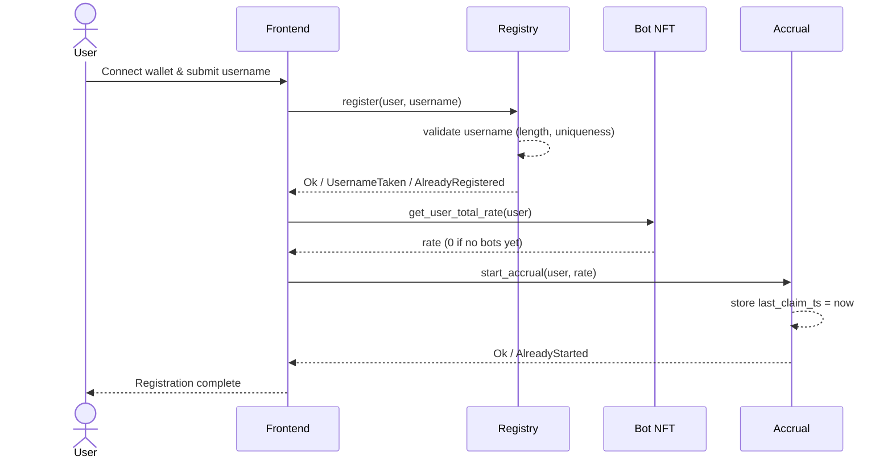
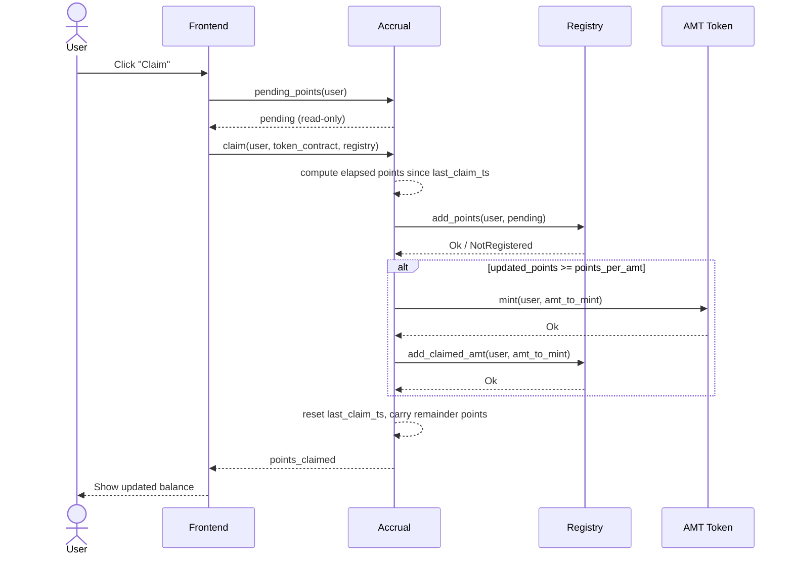
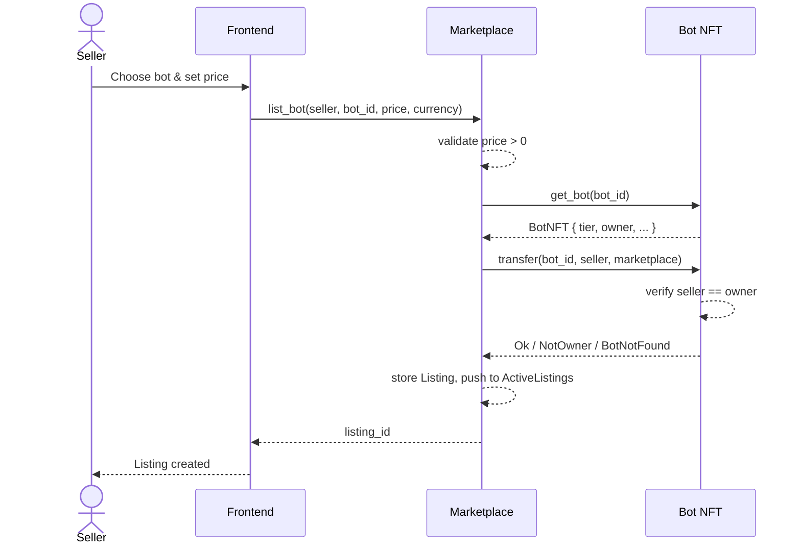
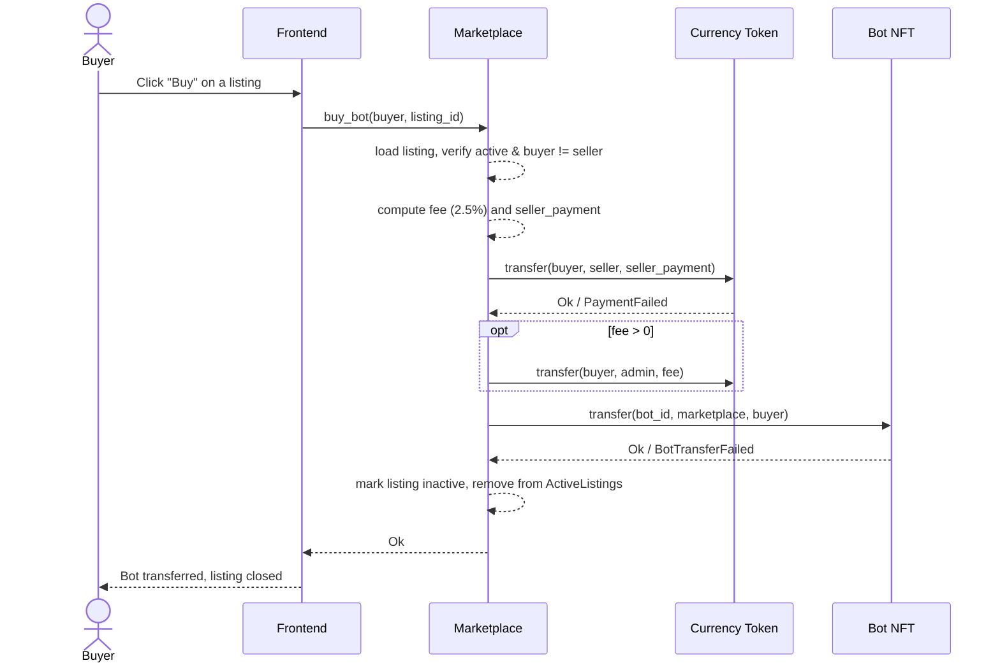

# Contract Interaction Flows

This document illustrates the cross-contract call sequences for the four core AutoMint flows: **register**, **claim**, **list**, and **buy**. Contract names match the crates under [`contracts/`](../contracts): `registry`, `bot_nft`, `accrual`, `marketplace`, `token`.

For testnet end-to-end manual verification steps and evidence capture, see [`MANUAL_TEST_REPORT.md`](./MANUAL_TEST_REPORT.md).

## Register

A new user creates a profile in the Registry, then starts their point-accrual clock.

## Claim

A user claims accrued points, which are credited to the Registry and, once enough points have accumulated, minted as AMT via the Token contract.

## List

A user escrows a Bot NFT into the Marketplace contract and creates a listing.

## Buy

A buyer purchases an active listing; payment is split between the seller and the marketplace fee recipient, and the bot is transferred out of escrow.

