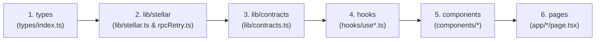

# Developer Onboarding Guide

Welcome to AutoMint! This guide walks new contributors through the codebase structure and recommended reading order. Whether you are adding a smart contract feature, updating frontend hooks, or building UI components, following this logical reading path will help you understand how all the pieces fit together.

---

## Architecture Overview & Stack

AutoMint is an idle auto-mining dApp built on Stellar (Soroban) and Next.js:

- **Smart Contracts (Soroban/Rust)**: `contracts/` directory contains 5 Rust crates (`token`, `registry`, `bot_nft`, `accrual`, `marketplace`) plus shared testing utilities in `contracts/testutils`.
- **Frontend (Next.js 14 App Router)**: `frontend/` directory built with React 18, TypeScript, Tailwind CSS, Zustand state management, TanStack React Query, and Framer Motion.
- **Stellar Wallet Integration**: Integrated with the [Freighter](https://freighter.app) browser extension using `@stellar/freighter-api` and `@stellar/stellar-sdk`.

---

## Recommended Code Reading Order

To quickly gain full context on data flow from on-chain contracts to React UI components, follow this 6-step reading order:



---

### Step 1: Data Models & Types (`frontend/src/types/index.ts`)

Start by reading [`frontend/src/types/index.ts`](file:///Users/macosbigsur/Documents/Code/AutoMint/frontend/src/types/index.ts). This file defines the foundational TypeScript interfaces representing core domain models across the system:

- `UserProfile`: On-chain user profile structure (`address`, `username`, `total_points`, `claimed_amt`, `registered_at`, `bot_count`).
- `BotNFT` & `BotTier`: Idle mining bot metadata, tier levels (`Basic`, `Bronze`, `Silver`, `Gold`, `Diamond`), rates, and prices.
- `Listing`: P2P marketplace listing data (`id`, `seller`, `bot_id`, `price`, `currency`, `active`).
- `AccrualState`: Real-time point accrual tracking state (`last_claim_ts`, `total_claimed_points`).
- `WalletState`: Client-side wallet state managed via Zustand.

---

### Step 2: Stellar & RPC Utilities (`frontend/src/lib/stellar.ts`)

Next, examine how the frontend communicates with the Stellar Testnet:

1. [`frontend/src/lib/stellar.ts`](file:///Users/macosbigsur/Documents/Code/AutoMint/frontend/src/lib/stellar.ts): Connects to Freighter wallet, resolves active public keys, constructs Soroban contract invocations, and handles transaction signing and submission.
2. [`frontend/src/lib/rpcRetry.ts`](file:///Users/macosbigsur/Documents/Code/AutoMint/frontend/src/lib/rpcRetry.ts): Robust exponential-backoff wrapper for Soroban RPC queries to prevent transient network errors from failing user requests.
3. [`frontend/src/lib/constants.ts`](file:///Users/macosbigsur/Documents/Code/AutoMint/frontend/src/lib/constants.ts): Network passphrases, RPC URLs, contract IDs, and default parameters.
4. [`frontend/src/lib/accrualLogic.ts`](file:///Users/macosbigsur/Documents/Code/AutoMint/frontend/src/lib/accrualLogic.ts): Pure client-side mathematical helpers for 24/7 interpolated points computation:
   $$\text{pending} = \frac{(\text{now} - \text{last\_claim\_ts}) \times \text{total\_rate}}{3600}$$

---

### Step 3: Soroban Contract Client Wrappers (`frontend/src/lib/contracts.ts`)

Read [`frontend/src/lib/contracts.ts`](file:///Users/macosbigsur/Documents/Code/AutoMint/frontend/src/lib/contracts.ts) to see how Soroban XDR responses are translated into strongly-typed JavaScript objects:

- `RegistryContract`: Methods for `register`, `getUser`, `isRegistered`, and `getLeaderboard`.
- `BotNFTContract`: Methods for `mintBasic`, `mintTier`, `getUserBots`, `getBot`, `getUserTotalRate`, and `transfer`.
- `AccrualContract`: Methods for `startAccrual`, `getAccrualState`, `pendingPoints`, and `claim`.
- `MarketplaceContract`: Methods for `listBot`, `cancelListing`, `getActiveListings`, `getUserListings`, and `buyBot`.
- `TokenContract`: Methods for `balance`, `allowance`, `approve`, and `transfer`.

---

### Step 4: React Query Hooks (`frontend/src/hooks/`)

Explore the custom React hooks that bridge lower-level contract calls with UI reactivity:

- [`useWallet.ts`](file:///Users/macosbigsur/Documents/Code/AutoMint/frontend/src/hooks/useWallet.ts): Wallet connection state, network validation, and Freighter auto-reconnect.
- [`useAccrual.ts`](file:///Users/macosbigsur/Documents/Code/AutoMint/frontend/src/hooks/useAccrual.ts): Fetches accrual state, calculates live client-side interpolated points, and handles point claim mutations.
- [`useMarketplace.ts`](file:///Users/macosbigsur/Documents/Code/AutoMint/frontend/src/hooks/useMarketplace.ts): Queries active marketplace listings, handles bot listing, cancellation, and purchasing mutations.
- [`useLeaderboard.ts`](file:///Users/macosbigsur/Documents/Code/AutoMint/frontend/src/hooks/useLeaderboard.ts): Fetches sorted leaderboard rankings with auto-refreshing React Query cache.
- [`useBotDetails.ts`](file:///Users/macosbigsur/Documents/Code/AutoMint/frontend/src/hooks/useBotDetails.ts): Fetches individual bot NFT metadata and user bot inventories.

---

### Step 5: UI Components (`frontend/src/components/`)

Review modular visual components organized by feature area:

- `ui/`: Primitive components ([`Modal.tsx`](file:///Users/macosbigsur/Documents/Code/AutoMint/frontend/src/components/ui/Modal.tsx), [`Skeleton.tsx`](file:///Users/macosbigsur/Documents/Code/AutoMint/frontend/src/components/ui/Skeleton.tsx)).
- `layout/`: Global navigation ([`Header.tsx`](file:///Users/macosbigsur/Documents/Code/AutoMint/frontend/src/components/layout/Header.tsx), [`Footer.tsx`](file:///Users/macosbigsur/Documents/Code/AutoMint/frontend/src/components/layout/Footer.tsx)).
- `dashboard/`: Mining stats, bot cards, claim button ([`PointsCounter.tsx`](file:///Users/macosbigsur/Documents/Code/AutoMint/frontend/src/components/dashboard/PointsCounter.tsx), [`BotCard.tsx`](file:///Users/macosbigsur/Documents/Code/AutoMint/frontend/src/components/dashboard/BotCard.tsx), [`ClaimButton.tsx`](file:///Users/macosbigsur/Documents/Code/AutoMint/frontend/src/components/dashboard/ClaimButton.tsx), [`UpgradePrompt.tsx`](file:///Users/macosbigsur/Documents/Code/AutoMint/frontend/src/components/dashboard/UpgradePrompt.tsx), [`RegistrationBanner.tsx`](file:///Users/macosbigsur/Documents/Code/AutoMint/frontend/src/components/dashboard/RegistrationBanner.tsx)).
- `marketplace/`: Trading cards and forms ([`BotListingCard.tsx`](file:///Users/macosbigsur/Documents/Code/AutoMint/frontend/src/components/marketplace/BotListingCard.tsx), [`ListBotModal.tsx`](file:///Users/macosbigsur/Documents/Code/AutoMint/frontend/src/components/marketplace/ListBotModal.tsx)).
- `leaderboard/`: On-chain rankings table ([`LeaderboardTable.tsx`](file:///Users/macosbigsur/Documents/Code/AutoMint/frontend/src/components/leaderboard/LeaderboardTable.tsx)).

---

### Step 6: App Router Pages (`frontend/src/app/`)

Finally, inspect the top-level Next.js pages:

- [`page.tsx`](file:///Users/macosbigsur/Documents/Code/AutoMint/frontend/src/app/page.tsx): Landing page with feature overview, stats, and getting started CTA.
- [`dashboard/page.tsx`](file:///Users/macosbigsur/Documents/Code/AutoMint/frontend/src/app/dashboard/page.tsx): Primary user dashboard for monitoring idle accrual, claiming `$AMT`, and managing owned bots.
- [`marketplace/page.tsx`](file:///Users/macosbigsur/Documents/Code/AutoMint/frontend/src/app/marketplace/page.tsx): P2P marketplace browse page for listing and buying bot NFTs.
- [`leaderboard/page.tsx`](file:///Users/macosbigsur/Documents/Code/AutoMint/frontend/src/app/leaderboard/page.tsx): Global rankings page showing top miners.
- [`profile/page.tsx`](file:///Users/macosbigsur/Documents/Code/AutoMint/frontend/src/app/profile/page.tsx): User profile overview, bot inventory, and claimed token stats.

---

## Local Development & Testing Workflow

### 1. Smart Contracts (Rust)
```bash
# Build all contracts
cargo build --target wasm32v1-none --release

# Run unit tests across workspace
cargo test --workspace
```

### 2. Frontend (Next.js)
```bash
cd frontend

# Install dependencies
npm install

# Run Jest unit and integration tests
npm test

# Launch local development server
npm run dev
```

### 3. Deploying Local/Testnet Contracts
```bash
# Generate key and deploy via automated deployment script
stellar keys generate mykey --network testnet
curl "https://friendbot.stellar.org/?addr=$(stellar keys address mykey)"
./scripts/deploy.sh testnet mykey
```

When opening Pull Requests, make sure to target `testnet-implementation` and verify all tests pass locally.
